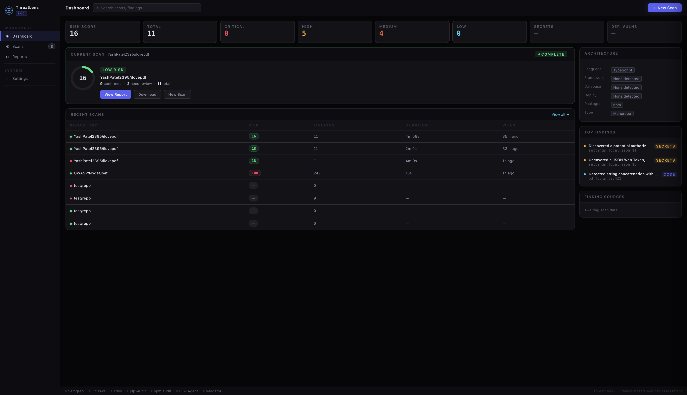
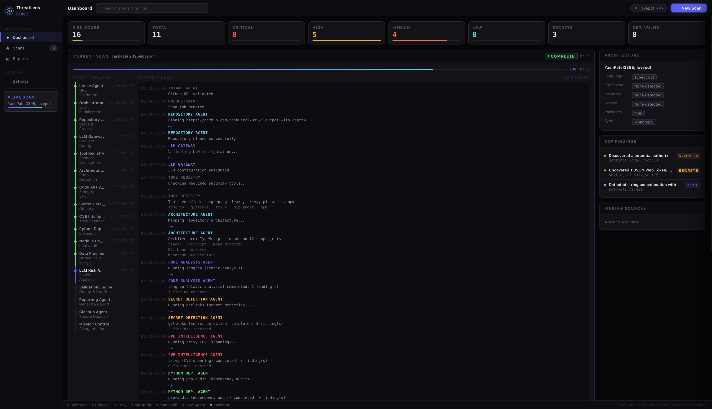
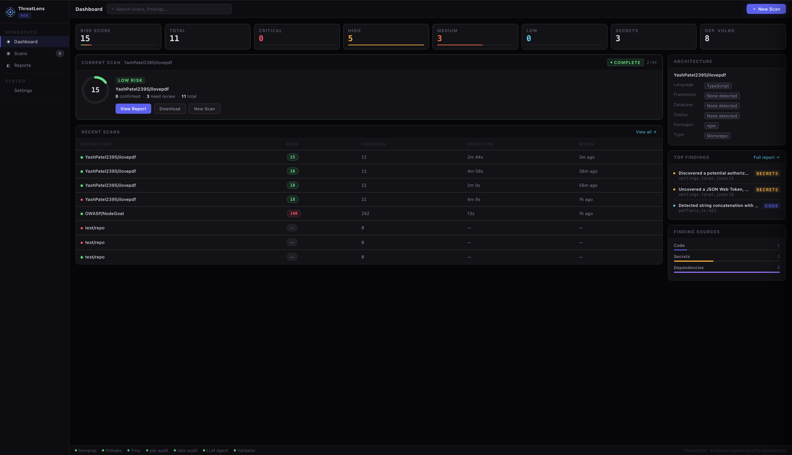
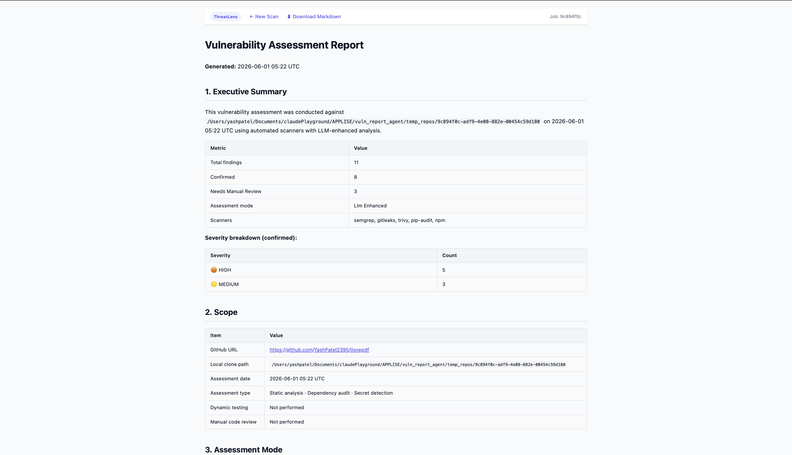

<div align="center">

# ThreatLens

**AI-powered Security Operations Center for GitHub repositories**

[](https://python.org)
[](https://fastapi.tiangolo.com)
[](https://anthropic.com)
[](#running-tests)
[](LICENSE)

Point ThreatLens at any public GitHub repo. It clones it, runs five security scanners in parallel, enriches every finding with Claude AI (impact · likelihood · exploit scenario · fix), and presents everything in a live SOC dashboard — risk score, agent pipeline, architecture map, and a full Markdown report.

[Quick Start](#setup) · [Web Dashboard](#web-dashboard) · [CLI](#cli) · [Pipeline](#pipeline) · [Tests](#running-tests)

</div>

---

## Screenshots

### SOC Dashboard — Idle State
> Persistent operations center. Recent scans survive page refresh via SQLite.



---

### Live Scan in Progress
> Six named AI agents run in sequence. Activity feed streams events in real time. Risk score animates as findings accumulate.



---

### Completed Scan — Risk Score 100 (NodeGoat)
> KPI cards, severity breakdown, architecture panel, and top findings populate automatically when the scan completes.



---

### Inline Report Viewer
> Full AI-enriched Markdown report rendered inside the dashboard. No separate page.



> **Adding screenshots:** Run the server (`uvicorn web.app:app --reload`), scan a repo, then screenshot each state and drop the images into `docs/screenshots/`.

---

## How It Works

```
GitHub URL  →  Clone  →  5 Scanners  →  Claude AI  →  SOC Dashboard + Report
```

| Stage | What happens |
|---|---|
| **Architecture detection** | Language, framework, database, auth, deployment, entry points |
| **semgrep** | Static analysis — 290+ rules, OWASP Top 10, injection, XSS, secrets |
| **gitleaks** | Secret / credential scan across git history and filesystem |
| **trivy** | CVE scan on OS packages and language dependencies |
| **pip-audit** | Python dependency audit against the repo's own `requirements.txt` |
| **npm audit** | Node dependency audit if `package.json` is present |
| **Claude enrichment** | Per-finding: impact, likelihood, exploit scenario, recommended fix |
| **Risk score** | 0–100 formula weighted by severity — Critical ×12, High ×2.5, Medium ×0.8, Low ×0.2 |
| **Report** | 10-section Markdown with full evidence chain |

---

## Features

- **Persistent SOC dashboard** — single-page app, no navigation away; scan history in SQLite survives restarts
- **Live agent pipeline** — six named agents (Architecture, Code Analysis, Secret Detection, Dependency Audit, AI Enrichment, Report Writer) with real-time status dots
- **Risk score ring** — animated 0–100 score, color-coded Low / Moderate / High / Critical
- **Architecture panel** — auto-detected stack: language, framework, database, auth, deployment
- **Top findings panel** — highest-severity hits from gitleaks + semgrep, shown immediately after scan
- **Inline report viewer** — rendered Markdown inside the dashboard; raw `.md` download also available
- **Secret redaction** — secret values are never written to reports or job output
- **Dual LLM support** — Anthropic (default) or OpenAI, switchable via `.env`
- **CLI mode** — run assessments without the web server
- **139 tests** — integration + web, including full end-to-end pipeline

---

## Setup

### Prerequisites

| Tool | Purpose | Install |
|------|---------|---------|
| [semgrep](https://semgrep.dev) | SAST | `brew install semgrep` |
| [gitleaks](https://github.com/gitleaks/gitleaks) | Secret detection | `brew install gitleaks` |
| [trivy](https://aquasecurity.github.io/trivy) | CVE scanning | `brew install trivy` |
| [pip-audit](https://pypi.org/project/pip-audit/) | Python dep audit | `pip install pip-audit` |
| npm *(optional)* | Node dep audit | ships with Node.js |

Python 3.10+ required. On macOS all tools are auto-installed via Homebrew if missing.

### Install

```bash
git clone https://github.com/YashPatel2395/ThreatLens.git
cd ThreatLens

python3 -m venv .venv && source .venv/bin/activate
pip install -r requirements.txt

cp .env.example .env
# Edit .env — add your ANTHROPIC_API_KEY (or OPENAI_API_KEY)
```

### `.env` reference

```dotenv
LLM_PROVIDER=anthropic          # or: openai
LLM_MODEL=claude-sonnet-4-6     # or: gpt-4o

ANTHROPIC_API_KEY=sk-ant-...
OPENAI_API_KEY=sk-proj-...      # only needed if LLM_PROVIDER=openai
```

---

## Web Dashboard

```bash
uvicorn web.app:app --reload
open http://127.0.0.1:8000
```

1. Click **New Scan** (or press `⌘K`)
2. Paste a public GitHub URL — e.g. `https://github.com/OWASP/NodeGoat`
3. Click **Deploy Agents**
4. Watch the live pipeline; risk score and KPIs update in real time
5. When complete, click any finding or open the inline report

**Notes:**
- Scan history persists in `threatlens.db` across server restarts
- Cloned repos are deleted immediately after scanning; only reports are kept
- Max 3 concurrent scans; 2-minute clone timeout; 500 MB working-tree limit

---

## CLI

```bash
# Full scan with LLM enrichment
python main.py /path/to/repo

# Scanner-only (no API key needed, faster)
python main.py /path/to/repo --skip-llm

# Test against the included vulnerable repo
python main.py test_vulnerable_repo --skip-llm
```

| Exit code | Meaning |
|-----------|---------|
| `0` | Full report written to `reports/vulnerability_assessment_report.md` |
| `1` | Setup / scanner / config failure — see `reports/incomplete_assessment.md` |
| `2` | Unexpected error |

---

## Pipeline

```
1. Validate LLM config     fail fast if key missing (unless --skip-llm)
2. Tool setup              check / auto-install scanners
3. Architecture mapping    detect language, framework, database, auth, deployment
4. Run scanners            semgrep · gitleaks · trivy · pip-audit [· npm audit]
5. Normalise               raw JSON → common schema, secrets redacted
6. LLM enrichment          impact · likelihood · exploit scenario · fix
7. Validate                dedup · CVE merge · test-file downgrade · quality-gate
8. Write report            10-section Markdown
```

Any failure in steps 1–4 stops the pipeline and writes an `incomplete_assessment.md` rather than producing a partial report.

---

## Report Sections

| # | Section | Contents |
|---|---------|----------|
| 1 | **Executive Summary** | Finding counts, severity breakdown, scan mode |
| 2 | **Scope** | Repository, date, assessment type |
| 3 | **Assessment Mode** | Scanner-only or LLM-enhanced (provider + model) |
| 4 | **Tools Executed** | Tool name, version, status |
| 5 | **System Overview** | Detected architecture table |
| 6 | **Findings Table** | Compact sortable summary of all findings |
| 7 | **Detailed Findings** | Evidence, impact, likelihood, exploit scenario, fix |
| 8 | **Needs Manual Review** | Low-confidence / test-file findings |
| 9 | **Limitations** | What static analysis cannot detect |
| 10 | **Recommendations** | Immediate actions + general hardening guidance |

---

## API Endpoints

| Method | Path | Description |
|--------|------|-------------|
| `GET` | `/` | SOC dashboard |
| `POST` | `/scan` | Start a scan (`{"repo_url": "..."}`) |
| `GET` | `/status/{job_id}` | Live job status, events, summary |
| `GET` | `/report/{job_id}` | Rendered HTML report |
| `GET` | `/report/{job_id}/markdown` | Raw Markdown download |
| `GET` | `/api/scans` | All historical scans (SQLite + live) |
| `GET` | `/api/scans/{job_id}/findings` | Top findings from raw scanner output |

---

## Project Structure

```
ThreatLens/
├── main.py                  # Pipeline orchestrator
├── config.py                # Paths, constants, LLM config
├── setup_tools.py           # Auto-install scanners
├── scanner_runner.py        # Execute scanners
├── normalizer.py            # Raw JSON → common finding schema
├── architecture_mapper.py   # Static repo architecture detection
├── llm_analyzer.py          # LLM enrichment (Anthropic / OpenAI)
├── validator.py             # Dedup, merge, downgrade, quality-gate
├── report_writer.py         # Markdown report generation
├── requirements.txt
├── .env.example             # Copy to .env and fill in keys
├── web/
│   ├── app.py               # FastAPI app + SQLite persistence
│   └── templates/
│       └── index.html       # SOC dashboard (single-page)
├── test_vulnerable_repo/    # Intentionally vulnerable repo for tests
└── tests/
    ├── conftest.py
    ├── fixtures/
    └── test_integration.py  # End-to-end pipeline tests
    └── test_web.py          # Web interface tests
```

---

## Running Tests

```bash
python -m pytest tests/ -v
```

139 tests covering:
- Architecture detection (language, framework, database, auth)
- Each scanner (SQL injection, secrets, CVEs)
- Normalizer schema validation
- Validator (dedup, CVE merge, test-file severity downgrade)
- Full end-to-end pipeline (10-section report, secret redaction, all findings present)
- Failure modes (missing key, bad path, incomplete report)
- Web interface (URL validation, job lifecycle, report serving, cleanup)

---

## Security Notes

- `.env` is git-ignored — never commit API keys
- Secret values are redacted before writing to any report or job file
- LLM is instructed not to invent findings — all analysis is grounded in scanner evidence
- Cloned repos are deleted from disk immediately after scanning
- Raw scanner output in `jobs/{job_id}/raw/` may contain path information — treat as confidential
